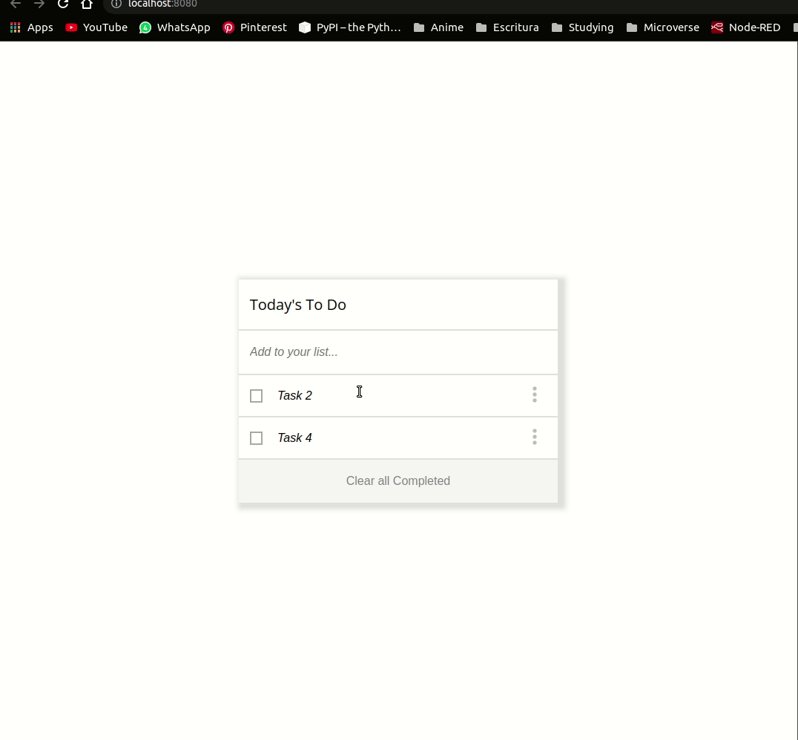

# To Do List

> In this project, I will build a simple HTML list of To Do tasks. This simple web page will be built using webpack and served by a webpack dev server



A simple and minimalistic To Do List to keep track on tasks during the day.

## Built With

- HTML/SCSS
- Webpack
- Visual Studio Code Editor

## Live Demo

[Live Demo Link](https://johnftitor.github.io/toDoList/dist/index.html)


## Getting Started

To get a local copy up and running follow these simple example steps.

- Clone this repository with git clone```git@github.com:JohnFTitor/toDoList.git``` using your terminal or command line.
- Change to the project directory by entering : <br>
```cd toDoList``` in the terminal

### Prerequisites

You need to make sure to have installed the latest version of Node.js and npm on your computer.

### Setup

You can clone this repository or simply download the files as a .zip
If you want to set up a personal repository based on this one, you can as well fork it.

### Install

After clone it and before working on it, you have to run ```npm install``` so that all the dependencies of the project get downloaded in your pc locally.
Such dependencies include webpack and linters checks, for which you have to either generate your own config file or get one. 

Note: If you're a Microverse's Student, you should use the config files provided by the program.
[Linters Config HTML/CSS and JS](https://github.com/microverseinc/linters-config/tree/master/html-css-js)

### Usage

You're free to use this project however you like it for educational purposes. Just keep in mind the acknowledgment described below

### Run linters checks

Linter Checks are automatically run with Github actions when there's a pull request. If you want to run them locally, remember to have the config file in the root of the local project. 

### Deployment

The deployment can be found in the Github Pages of this repository or through the link provided above

## Authors

👤 **Andrés Felipe Arroyave Naranjo**

- GitHub: [@JohnFTitor](https://github.com/JohnFTitor)
- Twitter: [@johnftitor](https://twitter.com/johnftitor)
- LinkedIn: [Andres](https://www.linkedin.com/in/andresfelipe117/?locale=en_US)

## Acknowledgments

## Show your support

Give a ⭐️ if you like this project!

## 📝 License

This project is [MIT](./MIT.md) licensed.
